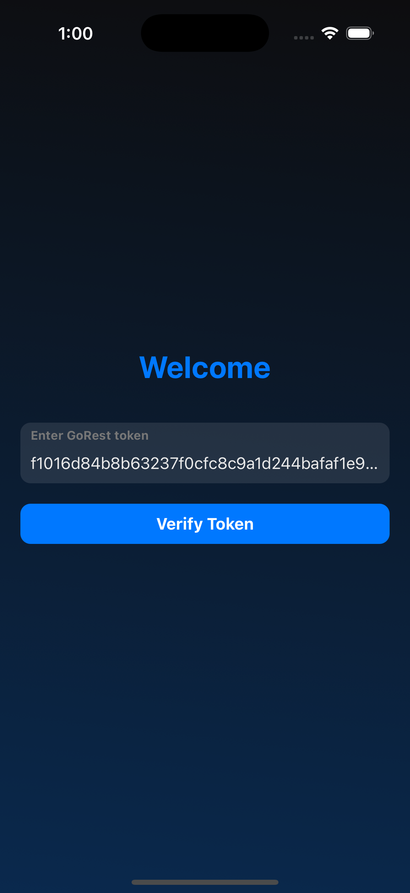
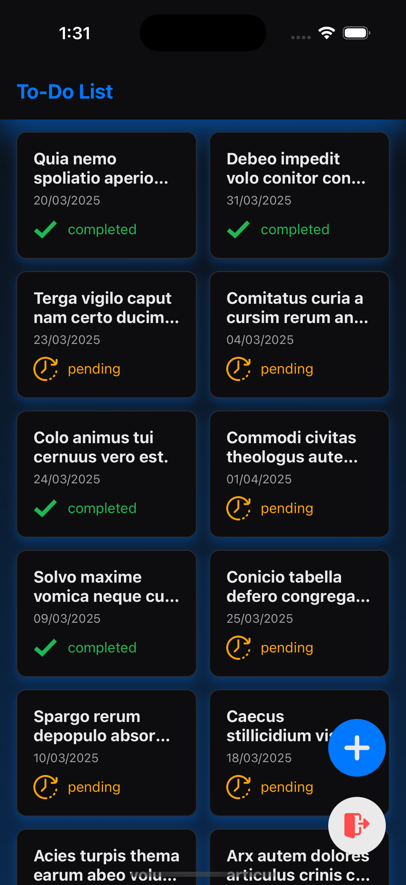
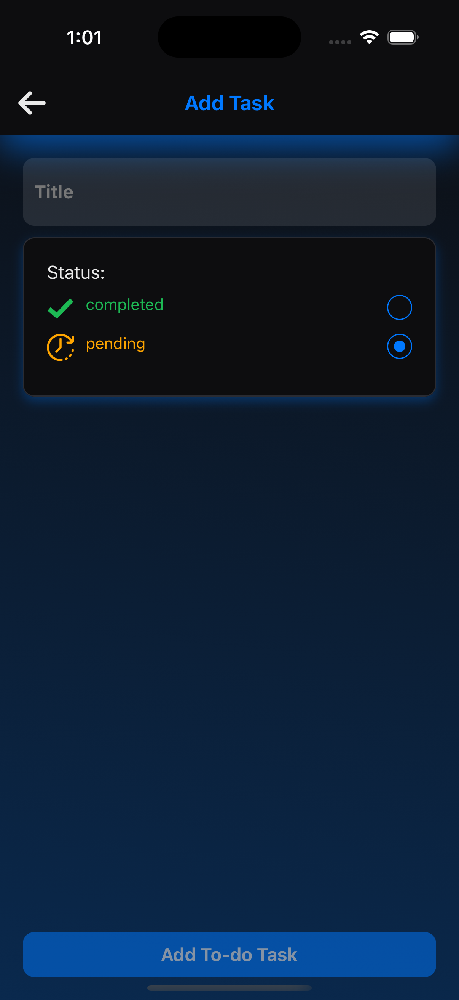
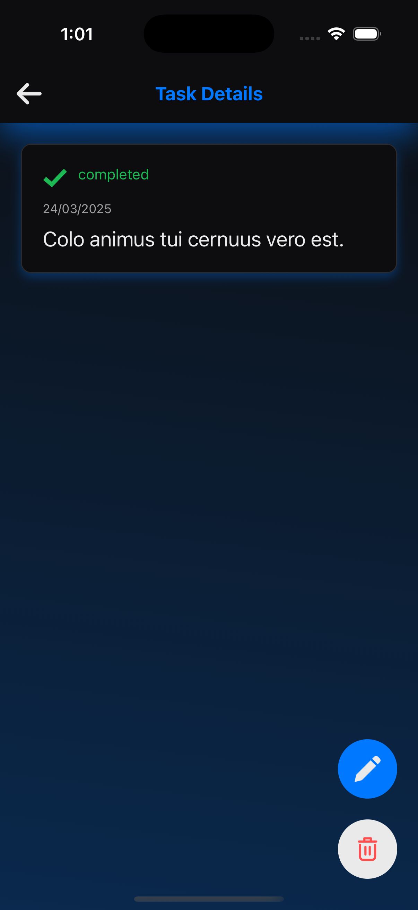
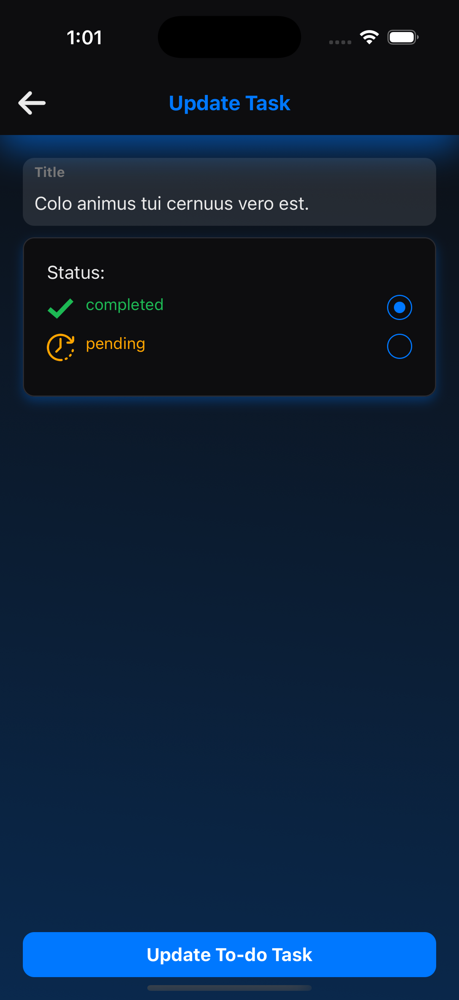
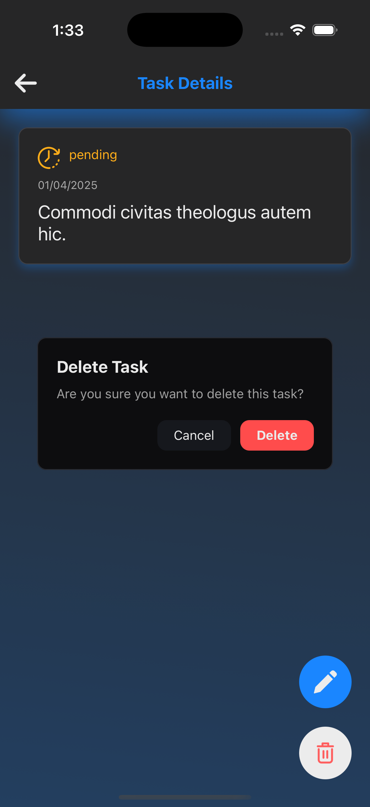
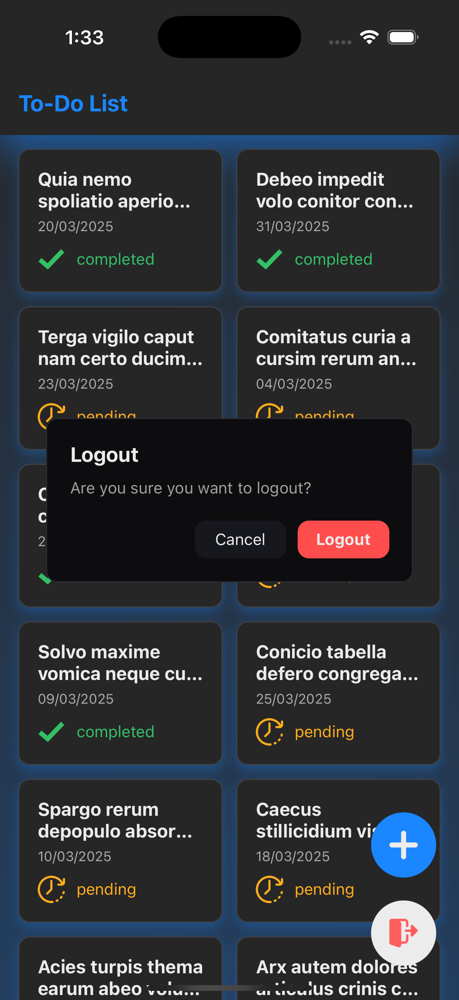

# TaskNavigator

## 📌 Overview

TaskNavigator is a **React Native to-do management application** designed for efficient task handling with authentication, offline support, deep linking, and an optimized user experience. This app follows best development practices, providing seamless state management, API handling, and navigation for both Android and iOS platforms.

With an intuitive user interface, TaskNavigator enables users to **add, edit, delete, and view** to-do tasks while ensuring data consistency even in offline mode. The app integrates Redux for state management and Axios interceptors for API handling, ensuring smooth interactions.

## 📖 Table of Contents

- [🚀 Getting Started](#-getting-started)
- [📂 Project Structure](#-project-structure)
- [🛠️ Tech Stack](#-tech-stack)
- [✨ Features](#-features)
- [📸 Screenshots](#-screenshots-mobile-view)

## 🚀 Getting Started

### Clone the Repository

```sh
git clone https://github.com/skviradiya/TaskNavigator.git
cd TaskNavigator
```

### Setup React Native Environment

Ensure your system is configured for React Native development. Follow the official setup guide: [React Native Environment Setup](https://reactnative.dev/docs/environment-setup).

### Install Dependencies

```sh
yarn install  # or npm install
```

### Run the Project

For Android:

```sh
npx react-native run-android
```

For iOS:

```sh
cd ios && pod install && cd ..
npx react-native run-ios
```

## 📂 Project Structure

```
App
├── assets/
│   ├── icons/              # Various PNG icons used in the app
│   ├── images/             # Placeholder for other image assets
│
├── axios/
│   ├── api.ts             # Centralized API handling with Axios
│   ├── offlineQueue.ts    # Handles offline API requests and queues them
│
├── components/
│   ├── NoInternetPopView.tsx     # Component to display internet connection errors
│   ├── common/                   # Reusable UI components
│   ├── home/                     # Components specific to the home screen
│
├── constants/
│   ├── ErrorMessage.ts      # Centralized error messages
│   ├── asyncAccess.ts       # Async storage keys
│   ├── colors.ts            # App color palette
│   ├── constants.ts         # App-wide constants
│   ├── screens.ts           # Screen navigation names
│
├── navigation/
│   ├── AuthStack.tsx        # Authentication flow navigation
│   ├── MainStack.tsx        # Main application navigation stack
│   ├── UserStack.tsx        # User-specific navigation
│
├── redux/
│   ├── slices/              # Redux slices for state management
│   ├── store.ts             # Redux store configuration
│
├── screens/
│   ├── SplashScreen.tsx     # Splash screen
│   ├── auth/                # Authentication-related screens
│   ├── users/               # User-related screens
│
├── styles/
│   ├── commonStyles.ts      # Global styles for UI components
│
├── types/
│   ├── navigation.d.ts      # Type definitions for navigation
│   ├── network.ts           # Type definitions for network functionalities
│   ├── slice/               # Type definitions for Redux slices
│
└── utils/
    ├── cacheFunc.ts        # Caching utilities for offline storage
    ├── navigationRef.ts    # Navigation reference handler
    ├── networkFunc.ts      # Utility functions for network requests
```

## 🛠️ Tech Stack

- **API**: [GoRest](https://gorest.co.in/) - Public API for testing CRUD operations
- **Networking & API Handling**: [Axios](https://www.npmjs.com/package/axios) - Handles API calls with interceptors
- **Navigation & Deep Linking**: [React Navigation](https://reactnavigation.org/) - Manages screen navigation
- **State Management**: [Redux Toolkit](https://redux-toolkit.js.org/introduction/getting-started) - Efficient state management
- **Offline Storage**: [Async Storage](https://react-native-async-storage.github.io/async-storage/docs/install/) - Manages offline data caching

## ✨ Features

### ✅ Authentication

- Secure token-based authentication
- Token handled globally with Redux
- API token validation via `GET /public/v2/users`

### 📋 To-do CRUD Operations

- **List To-dos**: Fetch via `GET /public/v2/todos`
- **Create To-do**: `POST /public/v2/todos` (requires `GET /public/v2/users` for `user_id`)
- **Edit To-do**: `PUT /public/v2/todos/:id`
- **Delete To-do**: `DELETE /public/v2/todos/:id`
- **Pagination Support**: Implemented in the home screen

### 🔗 Deep Linking

- Supported for both Android & iOS
- Works across all app states (foreground, background, killed)
- URL scheme: `tasknavigator://todo/:todoId`

### 📶 Offline Handling

- **Caching**: The home screen to-do list is cached for offline access
- **Sync Mechanism**: Uses AsyncStorage & Redux to sync offline actions when online

### 🎨 UI/UX Enhancements

- **Custom Styles**: Global stylesheet for consistency
- **Optimized Performance**: Fast rendering with efficient loaders, modals, and validations

## 📸 Screenshots (Mobile View)

<div align="center">

<table>
  <tr>
    <td align="center"><br><b>Login Screen</b></td>
    <td align="center"><br><b>Home Screen</b></td>
    <td align="center"><br><b>Add Task Screen</b></td>
    <td align="center"><br><b>Task Details Screen</b></td>
  </tr>
</table>

</div>

---

### Task Management

<div align="center">

<table>
  <tr>
    <td align="center"><br><b>Edit Task Screen</b></td>
    <td align="center"><br><b>Delete Task Popup</b></td>
    <td align="center"><br><b>Logout Popup</b></td>
  </tr>
</table>

</div>

---

🚀 **Developed with using React Native.**
